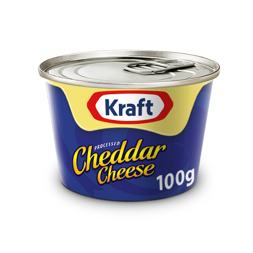
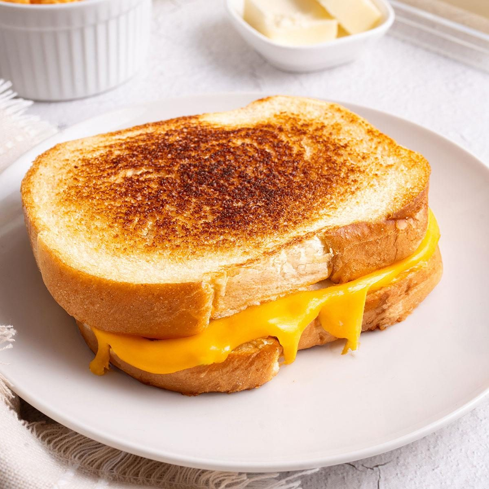
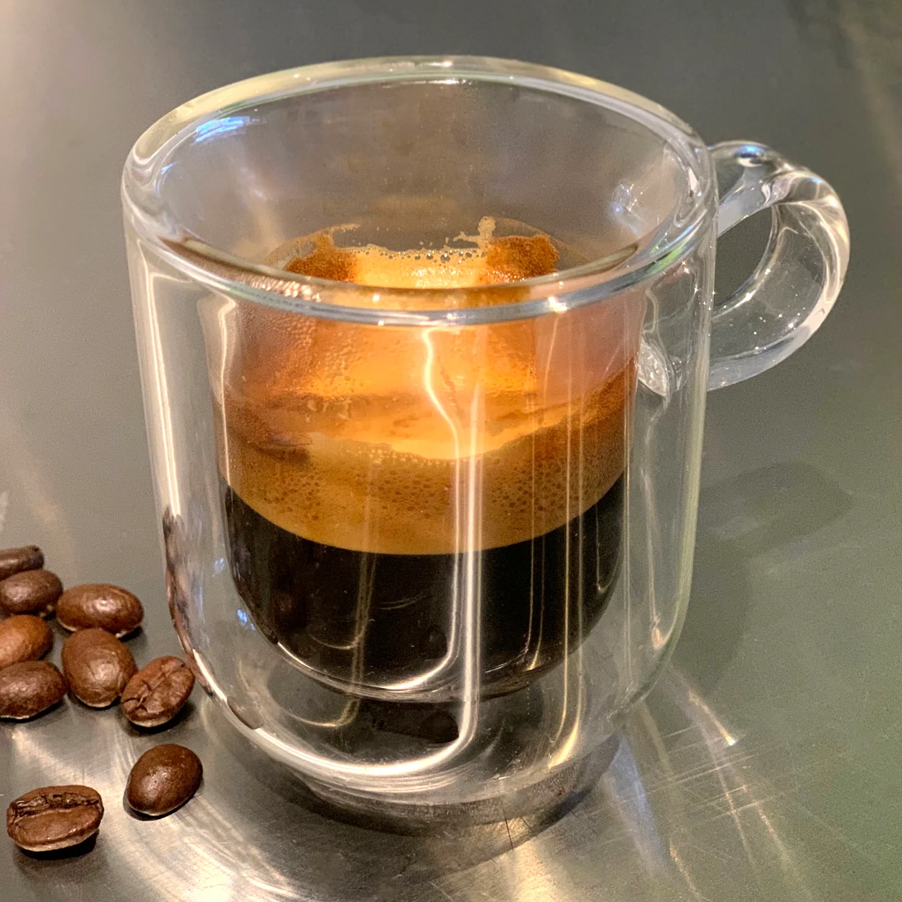
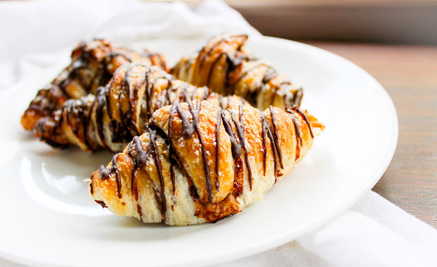
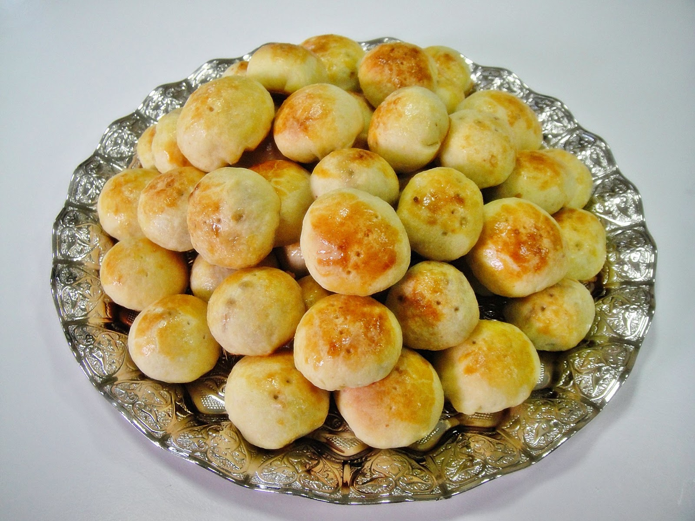

<!DOCTYPE html>
<html lang="en">
<head>
  <meta charset="UTF-8" />
  <meta name="viewport" content="width=device-width, initial-scale=0.50"/>
  <title>FMC GUEST CAFE Menu</title>
  <link href="l.jpg" rel="stylesheet">
  

  
</head>

<body>

<header>
  <h1>FMC GUEST CAFE MENU</h1>
</header>

  <button onclick="switchLang('en')">English</button>
  <button onclick="switchLang('ku')">کوردی</button>
  <button onclick="switchLang('ar')">العربية</button>

<!-- 🔤 English Menu -->

  <h2 class="section-title">Breakfast</h2>
  

    
 <h3>boiled eggs</h3>
1500

2 boiled eggs

    
 <h3>fried eggs</h3>
2000 

    
 <h3>omlette</h3>
2000 

    
 <h3>mekhlama</h3>
3000

    
 <h3>Lentil soup </h3>
1000

    
 <h3>kurdish cheese</h3>
2000 

    
 <h3>kiri cheese</h3>
500

    
 <h3>kraft cheese</h3>
2000

    
 <h3>kurdish sweet yogurt</h3>
2000 

    
 <h3>kurdish sour yogurt </h3>
2000 

    
 <h3>factory yogurt</h3>
1000

    
 <h3>jam</h3>
500

    
 <h3>walnut</h3>
1000

    
 <h3>tahini and date syrup</h3>
1000 

    
 <h3>olive </h3>
1000 

    
 <h3>breakfast meal</h3>
7000

    
 <h3>cheese toast</h3>
1000

    
 <h3>cheese sandwich</h3>
1000 

   
  
  

 

  <h2 class="section-title">Fast Foods</h2>
  

    
 <h3>cheese beef burger</h3>
9000

    
 <h3>beef burger</h3>
8000

    
 <h3>cheese Chicken burger</h3>
8000

    
 <h3>Chicken burger</h3>
8000

    
 <h3>fries</h3>
3000 

    
 <h3>steak</h3>
10000 

    
 <h3>fahita</h3>
10000

    
 <h3>kentucky</h3>
10000

    
 <h3>crispy</h3>
10000 

    
 <h3>mix pizza</h3>
8000 

    
 <h3>Chicken pizza</h3>
8000

    
 <h3>beef pizza</h3>
8000

    
 <h3>margrita pizza</h3>
7000 

    
 <h3>Chicken Escalope</h3>
10000 

    
 <h3>alfredo pasta</h3>
10000

    

 

  <h2 class="section-title">drinks</h2>
  

    
 <h3>espresso</h3>
3000

    
 <h3>americano</h3>
4000 

    
 <h3>capuccino</h3>
5000 

    
 <h3>latte</h3>
5000

    
 <h3>double espresso</h3>
5000 

    
 <h3>nescafe</h3>
2000 

    
 <h3>orange juice</h3>
5000

    
 <h3>apple juice</h3>
5000

    
 <h3>lemon juice</h3>
5000

    
 <h3>carrot juice</h3>
5000

    
 <h3>cocktail juice</h3>
5000

    
 <h3>tea</h3>
500

    
 <h3>water</h3>
500

 
  

  <h2 class="section-title">sweets</h2>
  

    
 <h3>cake</h3>
3000

    
 <h3>tres laches cake</h3>
3000 

    
 <h3>Croissant</h3>
3000 

    
 <h3>Cinnamon Roll
    </h3>
3500

    
 <h3>san sebastian cake</h3>
6000

    
 <h3>kliecha</h3>
2500 

    
 <h3>shakrlama</h3>
2500 

    
 <h3>mahalabia</h3>
2000

    
 <h3>cup cake</h3>
3000 

    

  

<!-- 🌐 Kurdish Menu -->

  <h2 class="section-title">نانی بەیانی</h2>
  

    
 <h3>هێلکەی کوڵاو</h3>
١٥٠٠ 

    
 <h3>هێلکەی سورەوکراو</h3>
٢٠٠٠ 

    
 <h3>ئۆملێت</h3>
٢٠٠٠ 

    
 <h3>مەخلەمە</h3>
٣٠٠٠ 

    
 <h3>Lentil soup </h3>
1000

    
 <h3>kurdish cheese</h3>
2000 

    
 <h3>kiri cheese</h3>
500

    
 <h3>kraft cheese</h3>
2000

    
 <h3>kurdish sweet yogurt</h3>
2000 

    
 <h3>kurdish sour yogurt </h3>
2000 

    
 <h3>factory yogurt</h3>
1000

    
 <h3>jam</h3>
500

    
 <h3>walnut</h3>
1000

    
 <h3>tahini and date syrup</h3>
1000 

    
 <h3>olive </h3>
1000 

    
 <h3>breakfast meal</h3>
7000

    
 <h3>cheese toast</h3>
1000

    
 <h3>cheese sandwich</h3>
1000 

  

<h2 class="section-title">Fast Foods</h2>

  
 <h3>cheese beef burger</h3>
9000

  
 <h3>beef burger</h3>
8000

  
 <h3>cheese Chicken burger</h3>
8000

  
 <h3>Chicken burger</h3>
8000

  
 <h3>fries</h3>
3000 

  
 <h3>steak</h3>
10000 

  
 <h3>fahita</h3>
10000

  
 <h3>kentucky</h3>
10000

  
 <h3>crispy</h3>
10000 

  
 <h3>mix pizza</h3>
8000 

  
 <h3>Chicken pizza</h3>
8000

  
 <h3>beef pizza</h3>
8000

  
 <h3>margrita pizza</h3>
7000 

  
 <h3>Chicken Escalope</h3>
10000 

  
 <h3>alfredo pasta</h3>
10000

  

  <h2 class="section-title">drinks</h2>
  

    
 <h3>espresso</h3>
3000

    
 <h3>americano</h3>
4000 

    
 <h3>capuccino</h3>
5000 

    
 <h3>latte</h3>
5000

    
 <h3>double espresso</h3>
5000 

    
 <h3>nescafe</h3>
2000 

    
 <h3>orange juice</h3>
5000

    
 <h3>apple juice</h3>
5000

    
 <h3>lemon juice</h3>
5000

    
 <h3>carrot juice</h3>
5000

    
 <h3>cocktail juice</h3>
5000

    
 <h3>tea</h3>
500

    
 <h3>water</h3>
500

 
  

  <h2 class="section-title">sweets</h2>
  

    
 <h3>cake</h3>
3000

    
 <h3>tres laches cake</h3>
3000 

    
 <h3>Croissant</h3>
3000 

    
 <h3>Cinnamon Roll
    </h3>
3500

    
 <h3>san sebastian cake</h3>
6000

    
 <h3>kliecha</h3>
2500 

    
 <h3>shakrlama</h3>
2500 

    
 <h3>mahalabia</h3>
2000

    
 <h3>cup cake</h3>
3000 

    

  

<!-- 🌐 Arabic Menu -->

  <h2 class="section-title">فطور</h2>
  

    
 <h3>هێلکەی کوڵاو</h3>
١٥٠٠ 

    
 <h3>هێلکەی سورەوکراو</h3>
٢٠٠٠ 

    
 <h3>ئۆملێت</h3>
٢٠٠٠ 

    
 <h3>مەخلەمە</h3>
٣٠٠٠ 

    
 <h3>Lentil soup </h3>
1000

    
 <h3>kurdish cheese</h3>
2000 

    
 <h3>kiri cheese</h3>
500

    
 <h3>kraft cheese</h3>
2000

    
 <h3>kurdish sweet yogurt</h3>
2000 

    
 <h3>kurdish sour yogurt </h3>
2000 

    
 <h3>factory yogurt</h3>
1000

    
 <h3>jam</h3>
500

    
 <h3>walnut</h3>
1000

    
 <h3>tahini and date syrup</h3>
1000 

    
 <h3>olive </h3>
1000 

    
 <h3>breakfast meal</h3>
7000

    
 <h3>cheese toast</h3>
1000

    
 <h3>cheese sandwich</h3>
1000 

   
  

  <h2 class="section-title">Fast Foods</h2>
  

    
 <h3>cheese beef burger</h3>
9000

    
 <h3>beef burger</h3>
8000

    
 <h3>cheese Chicken burger</h3>
8000

    
 <h3>Chicken burger</h3>
8000

    
 <h3>fries</h3>
3000 

    
 <h3>steak</h3>
10000 

    
 <h3>fahita</h3>
10000

    
 <h3>kentucky</h3>
10000

    
 <h3>crispy</h3>
10000 

    
 <h3>mix pizza</h3>
8000 

    
 <h3>Chicken pizza</h3>
8000

    
 <h3>beef pizza</h3>
8000

    
 <h3>margrita pizza</h3>
7000 

    
 <h3>Chicken Escalope</h3>
10000 

    
 <h3>alfredo pasta</h3>
10000

    

  
    <h2 class="section-title">drinks</h2>
    

      
 <h3>espresso</h3>
3000

      
 <h3>americano</h3>
4000 

      
 <h3>capuccino</h3>
5000 

      
 <h3>latte</h3>
5000

      
 <h3>double espresso</h3>
5000 

      
 <h3>nescafe</h3>
2000 

      
 <h3>orange juice</h3>
5000

      
 <h3>apple juice</h3>
5000

      
 <h3>lemon juice</h3>
5000

      
 <h3>carrot juice</h3>
5000

      
 <h3>cocktail juice</h3>
5000

      
 <h3>tea</h3>
500

      
 <h3>water</h3>
500

  
  
   
    

  <h2 class="section-title">sweets</h2>
  

    
 <h3>cake</h3>
3000

    
 <h3>tres laches cake</h3>
3000 

    
 <h3>Croissant</h3>
3000 

    
 <h3>Cinnamon Roll
    </h3>
3500

    
 <h3>san sebastian cake</h3>
6000

    
 <h3>kliecha</h3>
2500 

    
 <h3>shakrlama</h3>
2500 

    
 <h3>mahalabia</h3>
2000

    
 <h3>cup cake</h3>
3000 

    

  

<footer>
  
&copy; 2025 FMC CAFE. All rights reserved.

  
📠1048

</footer>

</body>
</html>
